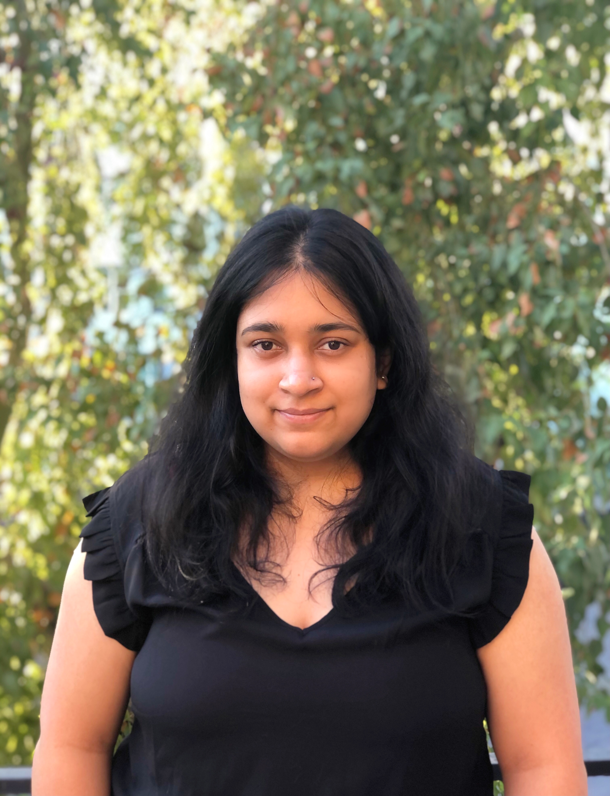

# Sinjini Mitra  
**AI Researcher | ML Scientist | Creative Thinker**

_Solving real-world problems with AI in GenAI, healthcare, scientific discovery, and document intelligence._

[📄 Resume](https://your-resume-link.com) &nbsp;&nbsp;|&nbsp;&nbsp; [💻 GitHub](https://github.com/sinjini15) &nbsp;&nbsp;|&nbsp;&nbsp; [🔗 LinkedIn](https://www.linkedin.com/in/sinjini-mitra/) &nbsp;&nbsp;|&nbsp;&nbsp; [✉️ Email](mailto:sinjinimitra94@gmail.com)

## 🔬 Projects

---

### Resume Screener AI  
Semantic resume ranking engine using LLM-based embeddings and job description matching.  
**Tags:** `#LLM` `#NLP` `#SemanticSearch` `#FastAPI`  
**Links:** [GitHub](https://github.com/Sinjini15/resume-screener-ai)

---

### Segmentation with GANs  
Data-efficient segmentation pipeline using a fine-tuned StyleGAN model with a custom ToRGB module for stylized mask generation.  
**Tags:** `#GAN` `#ComputerVision` `#Segmentation` `#Low data`  
**Links:** [GitHub](https://github.com/Sinjini15/Image-Segementation-with-GANs) 

---

### Histopathology Image Classification (Public)
CNN pipeline for cancer detection on PatchCamelyon histopathology dataset with GradCAM visualizations.  
**Tags:** `#ComputerVision` `#MedicalAI` `#GradCAM` `#PyTorch`  
**Links:** [GitHub](https://github.com/sinjini15/histopathology-cnn) 

---

### Local LLM-based RAG System (Public)
Built a lightweight Retrieval-Augmented Generation system with local LLMs for document-based Q&A.  
**Tags:** `#RAG` `#LLM` `#FAISS` `#LangChain`  
**Links:** [GitHub](https://github.com/Sinjini15/local-llm-rag-pdf-qa) 

---

### Learning the Chart of Nuclear Isotopes using GNNs (Private Summary)
Graph neural network models for structure-aware prediction of nuclear cross-section data.  
**Tags:** `#GNN` `#ScientificML` `#HeterogeneousGraphs` `#PyTorchGeometric`  
**Links:** [GitHub](https://github.com/Sinjini15/Nuclear-isotope-GNN) | [arXiv](https://arxiv.org/pdf/2404.02332)

---

### Mobility Prediction Using Graph Neural Networks (Private Summary)
**Private Summary**  
Modeled spatiotemporal mobility patterns using graph-based deep learning techniques. Developed custom edge- and node-level feature transformations for predictive tasks.  
**Keywords:** Mobility Prediction, Graph Neural Networks, Spatiotemporal Modeling.

---

## Notes

- Some research projects are private due to collaboration agreements or unpublished status. Summaries have been provided to demonstrate technical contributions.
- For selected private work, detailed descriptions and results can be discussed upon request during interviews.
